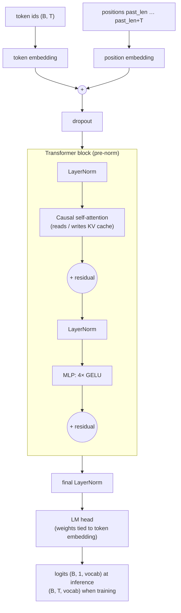
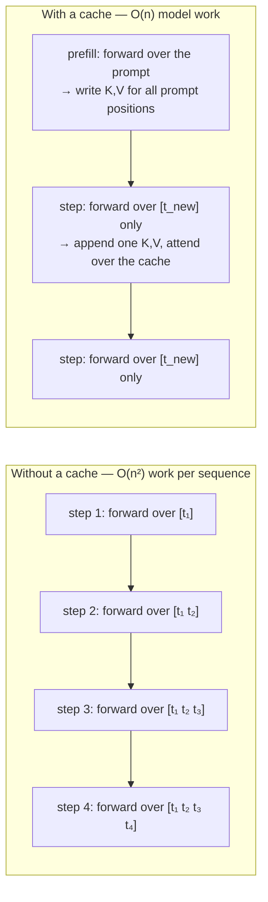
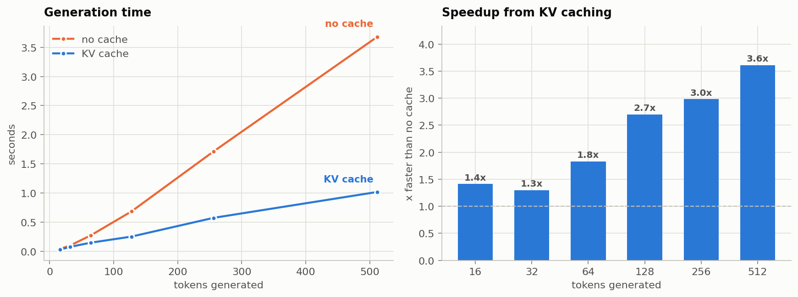
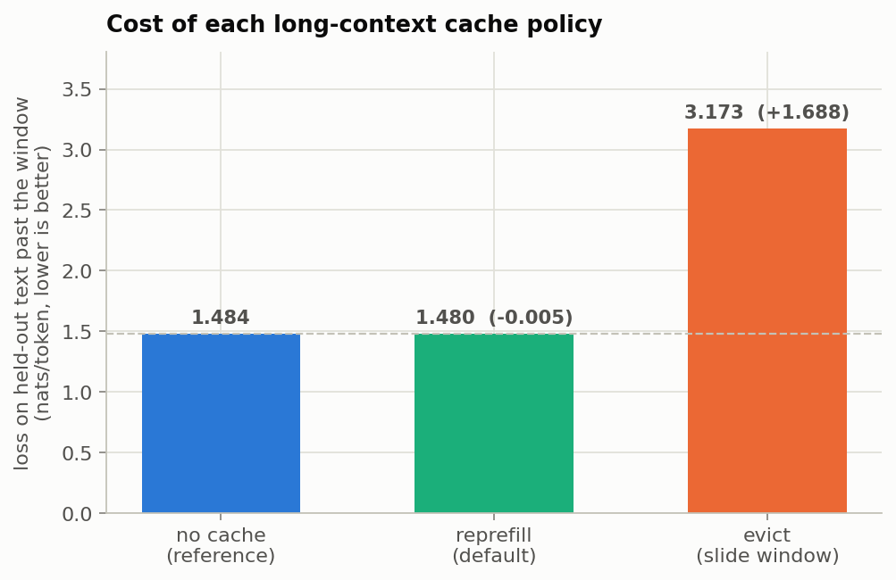
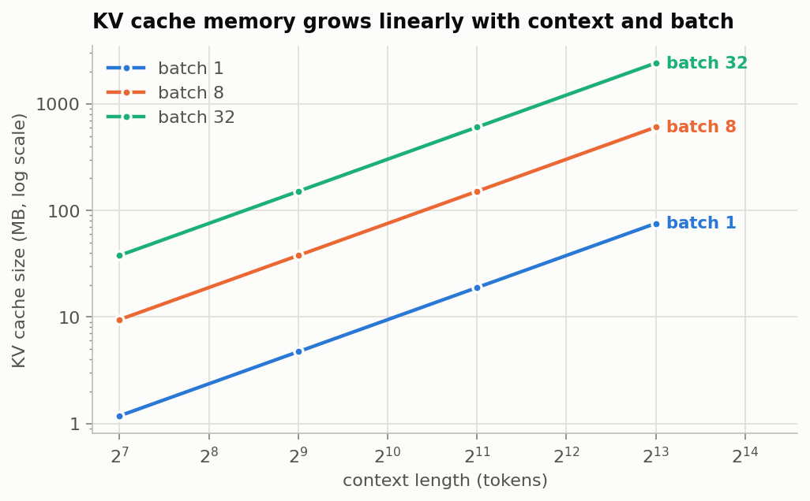
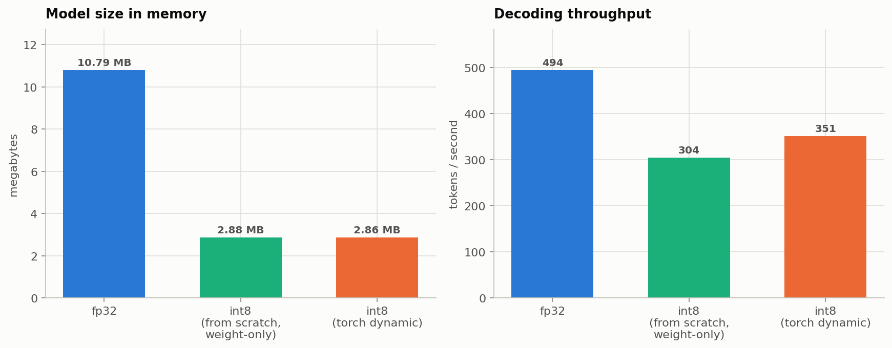
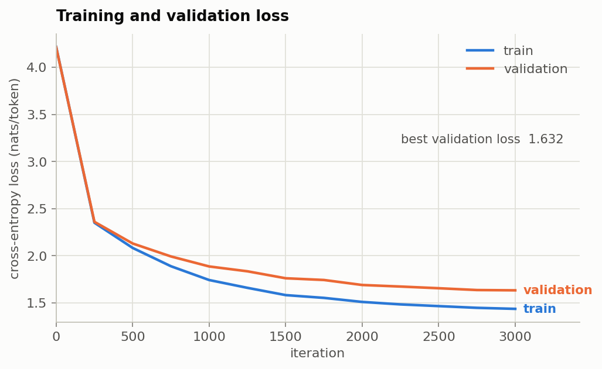

# Gideon

**Gideon** is a GPT-style decoder-only transformer **and its inference engine**,
written from scratch in PyTorch. No `nn.Transformer`, no `nn.MultiheadAttention`, no
HuggingFace — the attention maths, the KV cache, the tokeniser and the int8
quantiser are all implemented here and all covered by tests.

The point of the project is not "I can train a small language model." It is
**understanding what happens between a request arriving and a token coming
back**, and being able to measure it.

[](https://github.com/sharansrinivas25/gideon/actions/workflows/tests.yml)

---

## Headline results

Trained and measured end to end on 2 CPU cores — every number below is
reproducible with `make train && make bench`, and the raw output is committed
in [`results/benchmarks.json`](results/benchmarks.json).

| | Result |
|---|---|
| Model | 2.67M non-embedding params, 6 layers, 6 heads, `n_embd` 192, `block_size` 128 |
| Training | 3,000 iterations in **46 minutes on 2 CPU cores**; validation loss **4.213 → 1.632** |
| KV cache | **3.6× faster** at 512 tokens; throughput stays flat at ~500 tok/s while the uncached decoder decays from 376 → 139 tok/s |
| Latency | TTFT **7.8 ms** at a 127-token prompt; **1.72 ms** per decoded token |
| int8 quantisation | **3.75× smaller** (10.79 MB → 2.88 MB), and **slower** — see below for why that is the expected result |
| Long-context policy | Naive cache eviction costs **+1.69 nats** of held-out loss; the re-prefill policy costs **0.005** |
| Tests | **61 passing**, including cached-vs-uncached output equivalence |

The two results worth reading the code for are the **KV-cache scaling** and the
**cache-eviction bug I found by measuring output quality rather than only
speed**.

---

## What is in here

| Component | File | What it demonstrates |
|---|---|---|
| Multi-head causal self-attention | `gideon/attention.py` | QKV projection, head splitting, scaled dot product, causal masking — written out, not called |
| KV cache | `gideon/kvcache.py` | Pre-allocated per-layer cache; the reason decoding is linear rather than quadratic |
| Transformer stack | `gideon/model.py` | Pre-norm blocks, weight tying, depth-scaled init, last-position-only LM head |
| Tokenisers | `gideon/tokenizer.py` | Character-level, plus byte-level **BPE trained with the merge loop** |
| Sampling | `gideon/generate.py` | Temperature, top-k, nucleus (top-p); cached and uncached decoders with identical semantics |
| int8 quantisation | `gideon/quantize.py` | Symmetric per-output-channel weight quantisation, from scratch |
| Benchmarks | `gideon/benchmark.py` | TTFT, per-token decode latency, cache speedup, memory scaling |
| Tests | `tests/` | 61 tests, including cached-vs-uncached output equivalence |

---

## Architecture



### How attention actually computes

For each head, with query length `T`, key length `S`, head dim `d`:

```
Q, K, V  = split(x @ W_qkv)            # one fused GEMM, then split
scores   = Q @ Kᵀ / sqrt(d)            # (B, nh, T, S)
scores   = scores.masked_fill(future, -inf)
weights  = softmax(scores)             # each row sums to 1
out      = weights @ V                 # (B, nh, T, d)
y        = out.merge_heads() @ W_proj
```

The `sqrt(d)` division is not decoration. `Q·K` is a sum of `d` products of
roughly unit-variance terms, so its variance grows with `d`; without the scaling
the softmax saturates and gradients vanish before training starts.

---

## The KV cache

This is the core optimisation and the thing worth understanding.

A decoder is **causal**: token `t` attends only to tokens `≤ t`. So when you
generate one token at a time, the keys and values for every earlier token are
**bit-for-bit identical on every step**. Recomputing them is pure waste.



Two implementation details that matter more than they look:

**Pre-allocate, don't concatenate.** The cache is allocated once at
`max_seq_len` and filled in place. `torch.cat`-ing a new K/V each step
reallocates and copies the entire cache every token — quietly reintroducing the
quadratic memory traffic you were trying to remove.

**Offset the causal mask.** During cached decoding the query length is 1 but the
key length is `past + 1`. Applying the usual top-left-aligned triangular mask
would mask out almost everything. The mask has to be sliced with a row offset:

```python
mask = self.causal_mask[:, :, past_len : past_len + T, :S]
```

**How I know the cache is correct:** `tests/test_kvcache.py` asserts that
cached and uncached decoding produce **byte-identical token sequences** under a
fixed seed, plus that incremental single-token forwards match one full forward
pass to within 1e-5. An optimisation that changes the output is a bug, not an
optimisation.

### Measured speedup



| Tokens generated | No cache | KV cache | Speedup |
|---:|---:|---:|---:|
| 16 | 0.043 s (376 tok/s) | 0.030 s (528 tok/s) | 1.41× |
| 32 | 0.102 s (315 tok/s) | 0.078 s (409 tok/s) | 1.30× |
| 64 | 0.273 s (234 tok/s) | 0.149 s (429 tok/s) | 1.83× |
| 128 | 0.687 s (186 tok/s) | 0.255 s (503 tok/s) | 2.70× |
| 256 | 1.713 s (149 tok/s) | 0.575 s (445 tok/s) | 2.98× |
| 512 | 3.680 s (139 tok/s) | 1.020 s (502 tok/s) | **3.61×** |

The shape matters more than the ratio. **Cached throughput is flat** — ~500
tok/s whether you generate 16 tokens or 512 — while uncached throughput decays
steadily as the prefix grows. That flat line is the O(n) vs O(n²) difference
made visible, and it is why the speedup keeps widening with length.

Splitting latency into its two phases shows where the work goes:

| Prompt length | Time to first token | Per decoded token |
|---:|---:|---:|
| 8 | 2.78 ms | 1.64 ms |
| 32 | 3.58 ms | 1.71 ms |
| 64 | 4.78 ms | 1.74 ms |
| 127 | 7.80 ms | 1.72 ms |

TTFT grows with prompt length (prefill is a real matmul over the whole prompt);
per-token decode cost is essentially constant. Those are the two numbers a
serving system is judged on, and they have different bottlenecks — prefill is
compute-bound, decode is memory-bound.

### The bug that speed benchmarks would have hidden

My first implementation of "what happens when the context window fills up" was
the obvious one: **evict the oldest entries and slide the window forward.** It
benchmarked beautifully. It also produced this:

```
Which her the thate ffore atrege ownthe sthe ursstn therive mard; warvild y
mifthe th, tithon caly oonde thur aly t
Talaly cle t,
Therat t
```

The collapse starts at exactly character 128 — `block_size`. The cause is that
this model uses **learned absolute position embeddings**, which are added to
the input *before* K and V are computed. Slide an entry from slot 40 to slot 8
and its cached K/V still carry the position-40 embedding. The model is reading
a sequence whose positions contradict each other.

So I replaced the default with **`reprefill`**: when the window fills,
recompute K/V for the recent window so every entry's position embedding matches
the slot it now occupies. It costs one prefill every `block_size/4` steps —
roughly 10% overhead — and is still 3.6× faster than no cache at all.

To make that a measurement rather than an anecdote, `bench_window_policy` feeds
**real held-out text** through each policy and scores it against the true next
token, counting only positions past the window:



| Policy | Loss past the window | vs. uncached reference |
|---|---:|---:|
| No cache (reference) | 1.484 | — |
| `reprefill` (default) | 1.480 | **−0.005** |
| `evict` (slide window) | 3.173 | **+1.688** |

A cost of +1.69 nats per token is the model being wrecked, not degraded.

Both policies are kept and selectable, because **`evict` is the right answer for
a different architecture.** With RoPE, position is applied at attention time
rather than baked into the cached values, so entries can be re-indexed freely —
which is precisely why every modern long-context system uses rotary embeddings.
Having built the broken version first, I can explain that trade-off from
measurement instead of from a paper.

### What the cache costs you

Speed is bought with memory, and the memory is linear in both context length
and batch size:

```
bytes = 2 (K and V) × n_layer × n_embd × seq_len × batch × dtype_bytes
```



This is *the* constraint in real LLM serving: it is why long-context requests
are expensive, why vLLM introduced paged attention, and why grouped-query
attention exists (share K/V across query heads and the whole table shrinks by
the sharing factor).

---

## Quantisation

Every `nn.Linear` weight goes from fp32 (4 bytes) to int8 (1 byte) plus one
fp32 scale **per output channel**:

```
scale_o   = max_i |W[o,i]| / 127
W_q[o,i]  = round(W[o,i] / scale_o)     # int8, [-127, 127]
W        ≈ W_q × scale_o
```

Per-channel rather than per-tensor: a single outlier row would otherwise force a
huge scale and destroy the resolution of every other row. Symmetric (no zero
point) because weight distributions are roughly zero-centred.



| | Size | Shrinkage | Throughput |
|---|---:|---:|---:|
| fp32 | 10.79 MB | 1.00× | 495 tok/s |
| int8 weight-only (from scratch) | 2.88 MB | 3.75× | 304 tok/s |
| int8 dynamic (torch / fbgemm) | 2.86 MB | 3.78× | 351 tok/s |

Measured error on the round trip is small — relative RMSE under 1% on a
realistic weight tensor, asserted in `tests/test_quantize.py`.

**The honest result, which is the interesting one:** this is *weight-only*
quantisation and the matmul still runs in fp32 after dequantising. It buys 3.75×
on memory and **no CPU speedup at all** — negative, in fact, because
dequantisation costs time.

That is not a failed experiment; it is what the technique does. int8 pays off
when you are **memory-bandwidth bound** — large models, batch size 1, weights
streaming from HBM — not when you are compute-bound on a small model with a
warm cache. To show the contrast, `quantize.py` also wraps PyTorch's dynamic
quantisation, which quantises *activations* too and dispatches to real fbgemm
int8 kernels — it recovers most of the gap (351 vs 304 tok/s) but still does not
beat fp32 on a model this small.

One measurement trap worth flagging: the obvious way to report model size is to
sum `parameters()` and `buffers()`. PyTorch's dynamically-quantised Linear
stores its weights in a **packed opaque object that appears in neither**, so
that method reported a triumphant 20× saving that was pure accounting fiction.
`model_size_bytes` serialises the model instead and counts what is really
there.

---

## Training

Character-level model on TinyShakespeare (1.1M characters, 65-token vocab).



| | |
|---|---|
| Architecture | 6 layers, 6 heads, `n_embd` 192, `block_size` 128, dropout 0.2 |
| Parameters | 2,669,184 non-embedding |
| Optimiser | AdamW, lr 1e-3, 100-step warmup into cosine decay, grad clip 1.0 |
| Batch | 32 sequences × 128 tokens |
| Wall clock | 46.4 minutes on 2 CPU cores |
| Loss | train 4.216 → 1.435, **validation 4.213 → 1.632** |

Train and validation stay within ~0.2 nats of each other throughout, so the
model is not memorising — with 2.7M parameters against 1M training tokens, and
dropout at 0.2, there is not much room to.

The choices worth defending in an interview:

- **Pre-norm** (`x + f(norm(x))`) not post-norm, so there is a clean identity
  path from input to output and deep stacks train without a fragile schedule.
- **Weight tying** between the token embedding and the LM head — saves
  `vocab × n_embd` parameters and improves perplexity, because "the vector
  meaning token X" and "the vector you dot against to predict token X" are the
  same kind of object.
- **Depth-scaled init**: residual projections initialised at
  `0.02 / sqrt(2 × n_layer)`, because `n_layer` residual additions otherwise
  compound the variance at the output.
- **No weight decay on 1-D parameters** — decaying LayerNorm gains and biases
  toward zero regularises nothing and hurts.
- **Warmup then cosine decay**: Adam's second-moment estimate is unreliable for
  the first few steps, and full-size steps on an unreliable estimate produce a
  loss spike you never recover from.

### Sample output

`python -m gideon.generate --prompt "ROMEO:" --tokens 480 --temperature 0.8 --top-k 40 --seed 7`

```
ROMEO:
God and be suchord, let seal was the mour
Reath of thy forst me born to meet, and which
he plays the peace of lady:
Which her they ta'en were and good life such preson these
resk windars lame me; we never the royal of the
subjection, and sclett, for at the childress for here.
O, by most not here are far well.

CORIOLANUS:
For thou wast him towards, to light them own and traitor.

ROMEO:
True in the cannot away!

HENRY BOLINGBROKE:
Why should I live see you will
From of the n
```

This is not coherent English and it is not supposed to be. A 2.7M-parameter
character-level model trained for 46 minutes on 1M characters learns
*structure* — speaker labels, line breaks, capitalisation after a colon,
plausible English morphology, correctly balanced apostrophes — and stops well
short of meaning. The important property is that it stays stable across the
full 480 characters, well past the 128-token context window, which is the thing
the re-prefill policy is there to guarantee.

---

## Running it

```bash
pip install -e ".[dev]"

make test        # 61 tests
make train       # ~50 min on 2 CPU cores; minutes on a GPU
make bench       # writes results/benchmarks.json
make figures     # regenerates the plots in docs/

# generate text
python -m gideon.generate --ckpt results/ckpt.pt --prompt "ROMEO:" --tokens 500

# compare the decoders yourself
python -m gideon.generate --ckpt results/ckpt.pt --tokens 500 --no-cache
python -m gideon.generate --ckpt results/ckpt.pt --tokens 500 --int8
```

The trained checkpoint is not committed (10.8 MB); `make train` reproduces it in
~46 minutes on CPU, or a couple of minutes on any GPU. The benchmark JSON and
all figures **are** committed, so the numbers in this README can be checked
against their source without rerunning anything.

---

### Branching

Work happens on topic branches merged into `main` with `--no-ff`, so each
feature and each fix stays one reviewable unit in the history instead of
dissolving into a flat list of commits. `git log --graph --oneline` shows the
shape:

| Branch | Contents |
|---|---|
| `feat/tokenizers` | character-level and BPE tokenisers |
| `feat/transformer` | attention and the GPT stack |
| `feat/kv-cache` | cache and incremental decoding |
| `feat/quantisation-and-training` | int8, data pipeline, training loop |
| `feat/benchmarks` | benchmark harness and figures |
| `fix/context-window-collapse` | the position-embedding bug described above |
| `fix/quantisation-size-measurement` | honest model-size accounting |
| `docs/results-and-readme` | trained results and documentation |

## Testing

```
$ make test
61 passed in 5.18s
```

| Test file | Tests | What it covers |
|---|---:|---|
| `test_tokenizer.py` | 10 | char and BPE round-trip, unicode, compression ratio, save/load |
| `test_kvcache.py` | 9 | cache mechanics, overflow, cached-vs-uncached equivalence (greedy, sampled, batched) |
| `test_quantize.py` | 9 | int8 range, per-channel scales, round-trip error, size reduction, generation under int8 |
| `test_generate.py` | 7 | temperature, top-k, top-p, seed determinism, prompt preservation |
| `test_model.py` | 7 | shapes, initial loss ≈ ln(vocab), weight tying, gradient flow, single-batch overfit, parameter count |
| `test_sliding_window.py` | 7 | eviction correctness, long-generation performance |
| `test_attention.py` | 6 | attention maths vs two independent references, causality, softmax normalisation |
| `test_window_policy.py` | 6 | `reprefill` vs `evict` past the context window |

The tests that carry real weight:

- **`test_generated_sequences_are_identical`** — cached and naive decoding
  produce the same tokens under a fixed seed. This is the only acceptable
  behaviour for a cache.
- **`test_manual_matches_naive_loop`** — the vectorised attention is checked
  against an explicit per-head, per-position Python loop that is too simple to
  be wrong.
- **`test_causality_future_tokens_cannot_leak`** — scrambling token `t` must not
  change any output before `t`. If this fails, the model is cheating during
  training and will collapse at generation time.
- **`test_model_can_overfit_a_single_batch`** — the sanity check that catches
  almost every training bug. A model that cannot drive loss to ~0 on one fixed
  batch has a broken model or optimiser, not bad hyperparameters.
- **`test_initial_loss_is_near_uniform`** — an untrained model should score
  `ln(vocab_size)`. Anything much lower means information is leaking.

---

## Honest limitations

- Character-level tokenisation on a 1.1M-character corpus. The samples are
  Shakespeare-shaped, not coherent English — that is the ceiling of a 2.7M
  parameter model on this data, and it is fine, because the object of study is
  the machinery around it.
- Learned absolute position embeddings, not RoPE. Simpler to reason about;
  RoPE is the modern choice and would be the natural next change.
- Multi-head attention, not grouped-query or multi-query — so the KV cache is
  as large as it can be. Deliberate: it makes the memory scaling visible.
- Benchmarks are CPU-only (2 cores). The *shape* of the KV-cache result holds
  on GPU; the absolute numbers do not transfer, and int8 would look far better
  there, where inference is memory-bandwidth bound.
- Past `block_size` the default policy re-prefills the recent window rather
  than using attention sinks. It is correct and ~10% slower than free; it is
  not what a production system would do.
- The int8 path quantises weights only, and skips `lm_head` because it is tied
  to the token embedding.

## Possible next steps

RoPE · grouped-query attention · paged KV blocks · speculative decoding ·
continuous batching · fused kernels via `torch.compile`

---

## Licence

MIT
